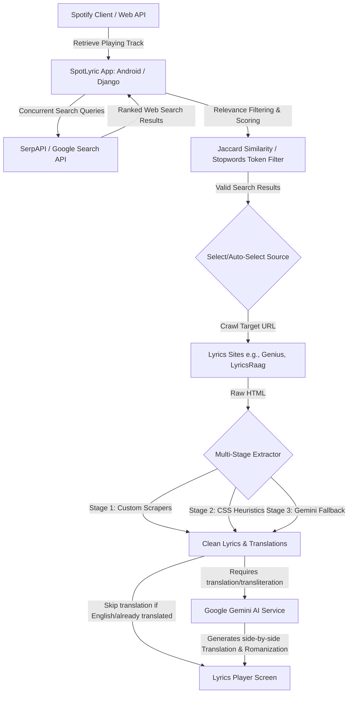

# SpotLyric: Real-Time Spotify Lyrics Extraction, Translation & Romanization

SpotLyric is an advanced, dual-platform open-source ecosystem designed to enhance your music listening experience. By integrating directly with Spotify, it automatically detects the currently playing song, queries high-quality lyrics sources, parses and extracts the content using a multi-stage pipeline, and uses Generative AI to provide real-time translation and phonetic romanization (transliteration) for foreign language tracks.

The project is organized as a monorepo consisting of:
1. **Android Client (`/android`)**: A native, performance-optimized Android application written in Kotlin and Jetpack Compose.
2. **Web Backend & Dashboard (`/web`)**: A Python Django web application providing a full-featured web dashboard.

---

## Architecture Flow

The diagram below illustrates how SpotLyric queries, extracts, translates, and displays lyrics.



---

## Core Features

### 1. Real-Time Spotify Integration
* **Instant Detection**: Periodically polls or receives updates from Spotify about what you are currently playing.
* **OAuth Authentication**:
  * **Android**: Uses **AppAuth** for the Spotify OAuth PKCE flow (no external Spotify Android SDK dependency is needed).
  * **Web**: Uses `spotipy` for secure OAuth 2.0 redirection and callback handshakes.

### 2. Intelligent Relevance Filtering & Scoring
* **Concurrent SerpAPI Queries**: Fires two queries at once (e.g., searching for original lyrics and translations) to maximize match variety.
* **Stopword-Aware Similarity**: Implements a **Jaccard Similarity (token-overlap)** algorithm that filters out generic words (like *the*, *feat*, *lyrics*) to ensure the search results actually belong to the currently playing song.
* **Composite Ranking Engine**: Scores search results based on domain reliability:
  * **Preferred domains**: +2.0 (user-prioritized domains configured in Settings)
  * **Tier 1 (Reliable domains)**: +1.0 (e.g., Genius)
  * **Tier 2 (General lyrics directories)**: +0.5
  * **Unreliable/Spam domains**: -0.5
  * **Token overlap similarity score** added to refine the order.

### 3. Multi-Stage Lyrics Extractor Pipeline
If you select a source or let the app choose automatically, it processes the URL through three sequential stages:
1. **Stage 1 (Domain Parsers)**: Custom scrapers designed for specific structures:
   * **Genius**: Targets elements matching `[data-lyrics-container]`.
   * **LyricsRaag**: Isolates `span.original` and `span.translated` for bilingual tracks.
2. **Stage 2 (CSS Heuristics)**: Uses broad, structures-based CSS class heuristics (`.lyrics`, `.lyric-content`, `.song-lyrics`, `.entry-content`) to scrape from unrecognized sites.
3. **Stage 3 (Gemini AI Fallback)**: Crawls the web page, cleans the HTML using `Trafilatura`/`Jsoup`, and feeds the clean text to Gemini (`gemini-2.5-flash-lite`) to extract original lyrics and existing translations.

### 4. AI-Driven Translation & Transliteration
* **Conditional Translation**: Skip translation processes when the track is in English or when translations are already successfully scraped.
* **Stanza-Boundary Chunking**: Songs longer than 80 lines are intelligently divided into ~40-line chunks, respecting stanza lines, and sent sequentially to Gemini to prevent response truncation.
* **Phonetic Romanization**: Transliterates scripts such as Devanagari (Hindi), Hangul (Korean), or Cyrillic (Russian) to Latin characters alongside the translation.

### 5. Seamless UI & Layouts
* **Autoscroll**: Supports Slow (37.5 px/s) and Fast (62.5 px/s) auto-scroll options.
* **Switch Source Dialog**: Instantly swap to other search results via a dialog in the toolbar to rerun the extraction pipeline on alternative URLs.
* **Keep Screen On**: Keeps the display awake while lyrics are playing.

### 6. Data Management & Resilience (Android)
* **Natural Key Mappings**: Bookmarks and lyrics are correlated using song name + artist name, avoiding primary key clashes across backups and different devices.
* **No-Permissions Backups**: Employs Android **Storage Access Framework (SAF)** to let users manually export and import JSON backups of settings, bookmarks, and cached lyrics without requesting intrusive storage permissions.
* **Destructive Migration Shield**: Automatically backs up database contents to internal storage before schema migrations; on schema mismatch/destructive updates, Room automatically imports the backup JSON, guaranteeing zero data loss.

---

## Folder Directory Structure

```text
.
├── android/                   # Native Android application codebase
│   ├── app/                   # Android Application module (Kotlin / Jetpack Compose)
│   │   └── src/main/java/     # Source files (data, domain, di, presentation layers)
│   ├── gradle/                # Gradle wrapper configuration & version catalog
│   ├── CHANGELOG.md           # History of Android-specific updates
│   ├── AI_AGENT_INSTRUCTIONS.md # Standards for AI contributions
│   ├── TODO.md                # Task tracker for Android features
│   └── README.md              # Android-specific docs
└── web/                       # Django web application codebase
    ├── spot_lyric/            # Django project settings
    ├── spotify/               # Main application app (views, models, utilities)
    ├── templates/             # HTML templates (index, lyrics page, management console)
    └── requirements.txt       # Python dependencies configuration
```

---

## Getting Started: Django Web Application

The web portal displays the user's currently playing track, lets them search/bookmark lyric pages, and allows manual management of cached lyrics databases.

### Prerequisites
* Python 3.10 or higher
* A Spotify Developer Account (to obtain a Client ID and Secret)
* A Google AI Studio Key (for Gemini)
* A SerpAPI Key (for Google Search queries)

### Setup & Installation
1. Navigate to the `web` directory:
   ```bash
   cd web
   ```
2. Create and activate a virtual environment:
   ```bash
   python -m venv .venv
   source .venv/bin/activate  # On Windows use: .venv\Scripts\activate
   ```
3. Install required dependencies:
   ```bash
   pip install -r requirements.txt
   ```
4. Configure environment variables. Copy the `.env.example` file to `.env`:
   ```bash
   cp .env.example .env
   ```
   Open the `.env` file and populate it with your credentials:
   ```env
   SECRET_KEY=generate-a-secure-random-key
   DEBUG=True
   ALLOWED_HOSTS=localhost,127.0.0.1

   SPOTIFY_CLIENT_ID=your_spotify_client_id
   SPOTIFY_CLIENT_SECRET=your_spotify_client_secret
   SPOTIFY_REDIRECT_URI=http://127.0.0.1:8000/spotify/callback

   SERPAPI_KEY=your_serpapi_key
   GEMINI_API_KEY=your_gemini_api_key
   ```
5. Apply database migrations:
   ```bash
   python manage.py migrate
   ```
6. Run the local development server:
   ```bash
   python manage.py runserver
   ```
7. Access the application in your browser at `http://127.0.0.1:8000/spotify/`.

---

## Getting Started: Android Application

The Android app provides a fully functional native experience on mobile devices, working directly on-device.

### Prerequisites
* Android Studio (Ladybug or higher recommended)
* Android SDK 35 (Target API level 35, minimum API level 26)
* JDK 17

### Setup & Configuration
1. Open the `/android` directory inside Android Studio.
2. In your root `local.properties` file (or `secrets.properties` inside the `android` folder), specify your API keys:
   ```properties
   SPOTIFY_CLIENT_ID=your_spotify_client_id
   SERPAPI_KEY=your_serpapi_key
   GEMINI_API_KEY=your_gemini_api_key
   ```
3. Set up the Redirect URI in Spotify Developer Dashboard:
   * Redirect URI: `spotlyric://callback`
4. Build and run the app on a physical Android device or an emulator.

### Android Codebase Organization
The Android application follows the **Clean Architecture** patterns, split into:
* **`domain`**: Model declarations and repository interfaces defining actions like retrieving active playback, toggling bookmarks, and fetching translations.
* **`data`**: Local database storage logic (Room DB, DataStore), custom Jsoup scrapers, network clients (Retrofit for Spotify & SerpAPI APIs), and Gemini API connections.
* **`presentation`**: UI layer powered by Jetpack Compose.
  * **`player`**: Screen detailing the current playing song.
  * **`lyrics`**: Displaying original and translated lyrics, handling scrolling and source dialog switching.
  * **`settings`**: Configuration screen (keys input, relevance thresholds tuning, data exports).
  * **`manage`**: List of saved songs and bookmarks.

---

## Developer Policy & Guidelines

Any AI agent or contributor modifying this codebase must adhere to the requirements in [AI_AGENT_INSTRUCTIONS.md](file:///home/pseudo/work/android/AI_AGENT_INSTRUCTIONS.md):
1. **Changelog Maintenance**: Update the respective `CHANGELOG.md` file whenever making changes to code, configurations, or documentations.
2. **Tasks & TODO Tracking**: Update `TODO.md` when initiating, completing, or introducing new tasks.
3. **No Unneeded Documentation**: Avoid creating new document files unless explicitly requested. Only `README.md`, `CHANGELOG.md`, and `AI_AGENT_INSTRUCTIONS.md` should exist.
